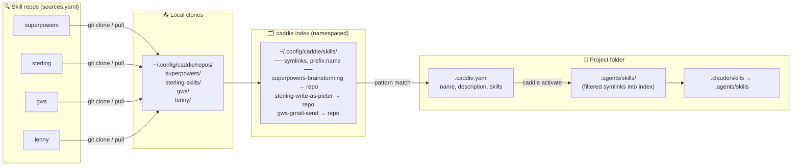

# caddie: Visual Guide

> **TL;DR:** caddie is a **skill profile manager** for Claude Code (and other coding agents).
> It gives every project folder its own curated toolbox of skills, pulled from git repos, wired up with symlinks.

---

## 🧩 The Problem

Claude Code reads skills from `.claude/skills/`. Without caddie you either have:

- **One global pile** in `~/.claude/skills/`, every project sees every skill, noisy and wrong-tool-for-the-job, or
- **Manual copies** per project, drift, stale forks, no shared source.

```
┌──────────────────────────────────────────────────────────────┐
│  ~/.claude/skills/   (before caddie)                         │
├──────────────────────────────────────────────────────────────┤
│  📦 brainstorming/         📦 gmail-send/                    │
│  📦 fastapi-review/        📦 figma-export/                  │
│  📦 jira-ticket/           📦 react-component/               │
│  📦 terraform-plan/        📦 slack-summary/                 │
│  📦 ...70 more...          📦 ...a mess...                   │
└──────────────────────────────────────────────────────────────┘
```

| ❌ Problem | 🤕 Consequence |
|---|---|
| All skills loaded everywhere | Claude picks the wrong skill for the job |
| Skills scattered across many git repos | Manual clone + copy, sync drift |
| No per-folder curation | Every project sees every skill |
| Profiles live only on one machine | Cloning the repo, or onboarding a teammate, doesn't bring the skill set with it |
| Symlinks break in Docker / Lambda | Can't ship skills to prod runtimes |

---

## ✨ What caddie Does

```
┌──────────────┐   ┌──────────────────┐   ┌───────────────────┐
│  Skill repos │   │  caddie index    │   │ Per-project skills│
│              │──▶│                  │──▶│                   │
│ git repos    │   │ ~/.config/       │   │ <project>/        │
│ (many)       │   │   caddie/skills/ │   │   .agents/skills/ │
│              │   │ (symlink layer)  │   │ (filtered symlinks)│
└──────────────┘   └──────────────────┘   └───────────────────┘
     clone+pull       namespace               activate
                      (prefix:name)           (pattern match)
```

**One sentence:** *Scan many skill repos → index them under one namespace → activate a curated subset per project folder as symlinks.*

---

## 🏗️ Architecture at a Glance



---

## 🔑 Two Core Concepts

### 1. **Skill repos & the index**: where skills come from

Repos are declared in `~/.config/caddie/sources.yaml`:

```yaml
repos:
  - name: superpowers
    url: https://github.com/Portauw/superpowers.git
    skills_path: skills
    prefix: superpowers
  - name: sterling-skills
    url: https://github.com/Portauw/sterling-skills.git
    skills_path: skills
    prefix: sterling
```

They are cloned to `~/.config/caddie/repos/<name>/`, auto-pulled on activate (at most once an hour), and flattened into one namespaced symlink layer:

```
~/.config/caddie/skills/
  ├── superpowers-brainstorming   → ~/.config/caddie/repos/superpowers/skills/brainstorming
  ├── sterling-write-as-pieter    → ~/.config/caddie/repos/sterling-skills/skills/write-as-pieter
  └── gws-gmail-send              → ~/.config/caddie/repos/gws/skills/gmail-send
```

Everything is a **symlink**, prefixed by source. This index is machine-wide and shared by every project; it is not a "source of truth", the truth lives in the source repos.

### 2. **The profile**: a `.caddie.yaml` in the folder you work in

There is no separate "environment" file and no registry to point at. `.caddie.yaml` IS the profile:

```yaml
# ~/Dev/my-backend/.caddie.yaml
name: "Backend API"
description: "Backend services"
skills:
  - "superpowers:*"        # all superpowers
  - "gws:gmail-*"          # just gmail skills
  - "sterling:*"           # all sterling skills
```

```
~/Dev/my-backend/
  ├── .caddie.yaml         ← the profile itself
  ├── .agents/skills/      ← created by caddie activate
  ├── .claude/skills  ───▶ .agents/skills
  └── src/
```

`caddie activate` walks up from the current directory to the nearest `.caddie.yaml`, so running it anywhere inside that tree resolves the same profile. There is no reuse mechanism across folders: if two projects want the same skill set, each needs its own `.caddie.yaml` (today that means copying one).

---

## ⚡ The Activation Pipeline

```
    ┌─────────────────────────────────────────────────────────┐
    │  $ cd ~/Dev/my-backend && caddie activate               │
    └──────────────────────────┬──────────────────────────────┘
                               │
                               ▼
          ┌────────────────────────────────────────┐
          │ 1. Find the nearest .caddie.yaml       │
          │    (walk up from cwd to /)             │
          └────────────────────────────────────────┘
                               │
                               ▼
          ┌────────────────────────────────────────┐
          │ 2. git pull every registered repo      │
          │    → ~/.config/caddie/repos/*          │
          │    (skipped if pulled within the hour) │
          └────────────────────────────────────────┘
                               │
                               ▼
          ┌────────────────────────────────────────┐
          │ 3. Rebuild the index                   │
          │    → ~/.config/caddie/skills/*         │
          │      (symlinks, namespaced)            │
          └────────────────────────────────────────┘
                               │
                               ▼
          ┌────────────────────────────────────────┐
          │ 4. Resolve the profile's skills:       │
          │    "superpowers:*" → 22 skills         │
          │    "gws:gmail-*"   →  3 skills         │
          │    "sterling:*"    →  5 skills         │
          │    ═══════════════════════════════     │
          │    Total: 30 active skills             │
          └────────────────────────────────────────┘
                               │
                               ▼
          ┌────────────────────────────────────────┐
          │ 5. Wire up project symlinks            │
          │    <proj>/.agents/skills/*  →  index   │
          │    <proj>/.claude/skills    →  .agents/│
          │                                skills  │
          └────────────────────────────────────────┘
                               │
                               ▼
                    ✅ Ready. Launch Claude.
```

Each project has its **own** `.agents/skills/`, a different filtered view of the same index. If nothing changed since the last activate (same profile, same resolved skills, symlinks still healthy), step 2-5 short-circuit via a fingerprint check.

---

## 🎯 Problems Solved

| Problem | How caddie solves it |
|---|---|
| 🔊 Skill noise across projects | Each project only symlinks its profile's skills |
| 🗂️ Skills scattered across many repos | Unified via `sources.yaml`, namespaced `prefix:name` |
| 🔁 Copy-paste skill sync | Repos auto-pull on activate |
| 🐳 Symlinks don't ship to Docker/Lambda | `caddie export` resolves links, copies real files (local or S3) |
| 🤷 "Which profile is active here?" | `caddie which` prints the resolved `.caddie.yaml` path |

`.caddie.yaml` is gitignored by default, so it does not travel with the repo. Sharing a setup across machines or teammates currently means sharing the file out of band (or documenting the pattern list somewhere) and running `caddie init`/`caddie edit` on each checkout; see [ADR 003](./adr/003-profile-replaces-environment.md) for why that trade-off was accepted.

---

## 🚀 A Day in the Life

```
Morning                                      Afternoon
───────                                      ─────────
$ cd ~/Dev/backend-api                       $ cd ~/Dev/marketing-site
$ caddie activate                            $ caddie activate
  ✓ Backend API                                ✓ Frontend
  Skills: 30 active                            Skills: 18 active
  (superpowers:22, gws:3, sterling:5)          (superpowers:12, sterling:6)

$ claude                                     $ claude
  → sees only backend-relevant skills          → sees only frontend-relevant skills
```

Same laptop. Same Claude. Two **completely different toolkits**, activated by `cd`, because each folder carries its own `.caddie.yaml`.

---

## 📤 Shipping Skills to Production

Symlinks don't survive Docker builds or Lambda packaging. `caddie export` resolves every link and copies the real `SKILL.md` files:

```
┌────────────────────────┐       ┌──────────────────────────┐
│ <project>/.agents/     │       │  ./dist/skills/          │
│     skills/            │──────▶│   (flat, real files)     │
│  (symlink tree)        │ resolve│                          │
│                        │ +copy │  superpowers-*/SKILL.md  │
│                        │       │  gws-*/SKILL.md          │
└────────────────────────┘       └──────────────────────────┘
                                           │
                                           ▼
                              🐳 Docker  ☁️ Lambda  🔄 CI/CD
```

```bash
cd ~/Dev/backend-api
caddie export --to ./dist/skills/
caddie export --to s3://my-bucket/skills/
```

---

## 🧭 Mental Model (one picture)

```
┌──────────────┐   scan    ┌──────────────┐  activate  ┌────────────────┐
│  SKILL REPOS │  ───────▶ │  caddie      │  ────────▶ │  PROJECT       │
│              │           │  INDEX       │  (filter)  │                │
│  git repos   │           │              │            │  .agents/      │
│  cloned to   │           │  ~/.config/  │            │    skills/     │
│  ~/.config/  │           │  caddie/     │            │  .claude/      │
│  caddie/     │           │  skills/     │            │    skills →    │
│  repos/      │           │  (symlinks,  │            │    .agents/... │
│              │           │   namespaced)│            │                │
└──────────────┘           └──────────────┘            └────────────────┘
       ▲                          ▲                           ▲
       │                          │                           │
   sources.yaml              prefix:name                 .caddie.yaml
                          namespacing rules            (IS the profile)
```

The index is not a "source of truth", it's a **unified namespaced view**. The truth lives in the source repos.

---

## 📚 Where to go next

- **Quick start:** [README.md](../README.md#quick-install)
- **Profile example:** [`examples/profile.yaml`](../examples/profile.yaml)
- **Architecture decisions:** [`docs/adr/`](./adr/)
- **Commands cheat sheet:** [README → All Commands](../README.md#all-commands)
